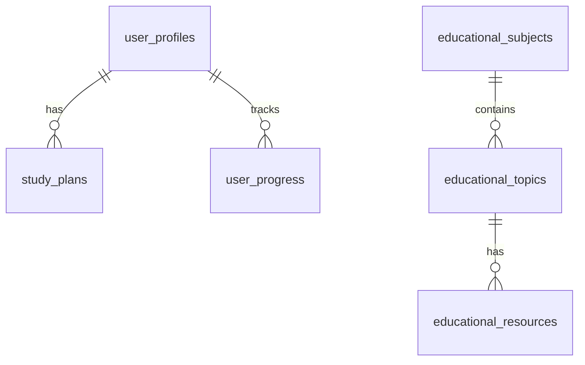

# YKS Plan - AI Destekli Çalışma Planlayıcısı


YKS'ye hazırlanan öğrenciler için yapay zeka destekli, kişiselleştirilmiş çalışma planları sunan modern web uygulaması.

## 🎯 Özellikler

### 🤖 AI Destekli Planlama
- **OpenAI GPT-4** entegrasyonu ile kişiselleştirilmiş haftalık planlar
- Öğrenci seviyesi ve alanına göre özel plan üretimi
- Akıllı kaynak önerileri ve çalışma stratejileri

### 📚 Kapsamlı Kaynak Veritabanı
- **500+** farklı çalışma kaynağı
- Kitap, video, PDF, uygulama kategorileri
- Seviye bazında filtrelenmiş öneriler
- MEB onaylı resmi kaynaklar dahil

### 🎮 Gamification Sistemi
- Puan ve rozet sistemi
- Çalışma serileri (streak) takibi
- Seviye ve başarım sistemi
- Sosyal özellikler ve liderlik tablosu

### 📱 PWA (Progressive Web App)
- Mobil uygulama deneyimi
- Offline çalışma desteği
- Push notification desteği
- Hızlı yükleme ve performans

### 📊 Detaylı Analytics
- Çalışma saati takibi
- İlerleme grafikleri
- Performans analizi
- Haftalık raporlar

### 🤝 AI Mentor
- 7/24 yapay zeka rehberi
- Konu bazında soru cevap
- Motivasyon desteği
- Kişiselleştirilmiş tavsiyeler

## 🚀 Teknoloji Stack

### Frontend
- **React 18** - Modern UI framework
- **TypeScript** - Type safety
- **Tailwind CSS** - Utility-first CSS
- **Framer Motion** - Animations
- **Radix UI** - Accessible components
- **Recharts** - Data visualization
- **React Router** - Client-side routing

### Backend & Database
- **Supabase** - PostgreSQL database
- **Supabase Auth** - Authentication
- **Real-time subscriptions**
- **Row Level Security (RLS)**

### AI & APIs
- **OpenAI GPT-4** - AI plan generation
- **OpenAI GPT-3.5-turbo** - AI mentor
- **Custom prompt engineering**

### Development Tools
- **Vite** - Build tool
- **ESLint** - Code linting
- **Jest** - Testing framework
- **TypeScript** - Static typing

## 🛠️ Kurulum

### Gereksinimler
- Node.js 18+ 
- npm veya yarn
- Supabase hesabı
- OpenAI API anahtarı

### 1. Proje Klonlama
```bash
git clone https://github.com/your-username/yks-plan.git
cd yks-plan/web
```

### 2. Dependencies Kurulumu
```bash
npm install
```

### 3. Environment Variables
`.env` dosyası oluşturun:
```env
# OpenAI API Configuration
VITE_OPENAI_API_KEY=your-openai-api-key-here

# Supabase Configuration
VITE_SUPABASE_URL=your-supabase-url-here
VITE_SUPABASE_ANON_KEY=your-supabase-anon-key-here

# Development
VITE_NODE_ENV=development
```

### 4. Supabase Database Setup
```bash
# Supabase SQL Editor'de çalıştırın
cat ../supabase_educational_resources_schema.sql
```

### 5. Geliştirme Sunucusu
```bash
npm run dev
```

Uygulama `http://localhost:5173` adresinde çalışacaktır.

## 📂 Proje Yapısı

```
web/
├── public/
│   ├── manifest.json          # PWA manifest
│   ├── sw.js                  # Service worker
│   └── icons/                 # PWA icons
├── src/
│   ├── components/
│   │   ├── ui/                # Shared UI components
│   │   ├── layout/            # Layout components
│   │   └── auth/              # Authentication
│   ├── pages/
│   │   ├── HomePage.tsx       # Ana sayfa
│   │   ├── SourcesPage.tsx    # Kaynak önerileri
│   │   ├── ProfilePage.tsx    # Profil ve istatistikler
│   │   ├── LoginPage.tsx      # Giriş sayfası
│   │   └── RegisterPage.tsx   # Kayıt sayfası
│   ├── lib/
│   │   ├── ai/                # AI services
│   │   ├── plan-generator/    # Plan generation
│   │   ├── gamification.ts    # Gamification system
│   │   ├── notifications.ts   # Push notifications
│   │   ├── performance.ts     # Performance monitoring
│   │   └── error-handling.ts  # Error handling
│   ├── data/
│   │   └── educational-resources.json # Eğitim kaynakları
│   └── store/
│       └── planStore.ts       # State management
```

## 🔧 Yapılandırma

### Supabase Setup

1. **Supabase projesi oluşturun**
2. **Database şemasını import edin:**
   ```sql
   -- supabase_educational_resources_schema.sql dosyasını çalıştırın
   ```
3. **RLS (Row Level Security) ayarlarını yapın**
4. **API anahtarlarını `.env` dosyasına ekleyin**

### OpenAI Setup

1. **OpenAI hesabı oluşturun**
2. **API anahtarı alın**
3. **`.env` dosyasına ekleyin**

## 📊 Veritabanı Şeması

### Ana Tablolar

- `user_profiles` - Kullanıcı profilleri
- `study_plans` - Çalışma planları
- `user_progress` - İlerleme takibi
- `educational_subjects` - Dersler
- `educational_topics` - Konular
- `educational_resources` - Kaynaklar

### İlişkiler



## 🎮 Gamification Sistemi

### Puan Sistemi
- **Görev tamamlama:** 10-50 puan
- **Günlük hedef:** 25-100 puan  
- **Haftalık hedef:** 100-300 puan
- **Streak bonusu:** 10-50 puan/gün

### Başarımlar
- **Çalışma saati:** 1h, 50h, 200h, 500h
- **Seri:** 7 gün, 30 gün, 100 gün
- **Görev:** 100, 500, 1000 görev
- **Özel:** Erken kuş, gece kuşu, hız şeytanı

### Seviye Sistemi
- **100 puan = 1 seviye**
- **Seviye arttıkça yeni özellikler**
- **Özel rozetler ve unvanlar**

## 🔔 Push Notifications

### Bildirim Türleri
- **Günlük hatırlatmalar** (09:00, 14:00, 19:00, 21:00)
- **Görev hatırlatmaları**
- **Motivasyon mesajları**
- **Haftalık raporlar**
- **Başarım bildirimleri**

### Kurulum
```javascript
import { notificationManager } from '@/lib/notifications'

// Initialize
await notificationManager.initialize()

// Send notification
await notificationManager.showNotification({
  title: 'Çalışma Zamanı!',
  body: 'Bugünkü planını tamamlamayı unutma!'
})
```

## 🤖 AI Mentor Kullanımı

### Temel Kullanım
```javascript
import { aiMentorService } from '@/lib/ai/mentor'

// Start session
const session = await aiMentorService.startSession(userId, 'matematik')

// Send message
const response = await aiMentorService.sendMessage(
  session.id,
  'Fonksiyonları anlamıyorum',
  studyContext
)
```

### Desteklenen Konular
- **Matematik:** Fonksiyonlar, türev, integral, geometri
- **Fizik:** Hareket, kuvvet, elektrik, optik
- **Kimya:** Atom, tepkimeler, çözünürlük
- **Türkçe:** Paragraf, dil bilgisi, kompozisyon
- **Motivasyon:** Çalışma teknikleri, zaman yönetimi

## 📈 Performance Monitoring

### Otomatik İzleme
- **Page load times**
- **Component render times** 
- **API response times**
- **Memory usage**
- **Network performance**

### Manual Measurement
```javascript
import { performanceMonitor } from '@/lib/performance'

// Measure component render
performanceMonitor.measureComponentRender('MyComponent', () => {
  // Render logic
})

// Measure async operation
await performanceMonitor.measureAsyncOperation('api-call', async () => {
  return await fetch('/api/data')
})
```

## 🚨 Error Handling

### Otomatik Hata Yakalama
- **JavaScript errors**
- **Unhandled promises**
- **Network errors**
- **Resource loading errors**

### Manual Error Logging
```javascript
import { errorHandlingService } from '@/lib/error-handling'

try {
  // Risky operation
} catch (error) {
  errorHandlingService.logError({
    message: error.message,
    severity: 'high',
    context: { operation: 'user-action' }
  })
}
```

## 🔐 Güvenlik

### Authentication
- **Supabase Auth** entegrasyonu
- **JWT token** tabanlı
- **Multi-provider** destek
- **Session yönetimi**

### Authorization
- **Row Level Security (RLS)**
- **Role-based access**
- **API endpoint protection**
- **Data encryption**

### Privacy
- **GDPR uyumlu**
- **Veri minimizasyonu**
- **Şifreleme**
- **Audit logging**

## 📱 Mobile & PWA

### PWA Özellikleri
- **Offline çalışma**
- **App-like deneyim**
- **Push notifications**
- **Install prompt**
- **Background sync**

### Responsive Design
- **Mobile-first yaklaşım**
- **Tablet desteği**
- **Touch-friendly interface**
- **Adaptive layouts**

## 🧪 Testing

### Test Türleri
```bash
# Unit tests
npm run test

# Integration tests  
npm run test:integration

# E2E tests
npm run test:e2e

# Coverage report
npm run test:coverage
```

### Test Yapısı
- **Component tests** - React Testing Library
- **Hook tests** - Custom hooks
- **Service tests** - API services
- **Integration tests** - User flows

## 🚀 Deployment

### Production Build
```bash
npm run build
```

### Netlify Deployment
1. **GitHub'a push edin**
2. **Netlify'da proje bağlayın**
3. **Environment variables ayarlayın**
4. **Deploy edin**

### Vercel Deployment
```bash
npm i -g vercel
vercel --prod
```

### Environment Variables (Production)
```env
VITE_OPENAI_API_KEY=your-production-key
VITE_SUPABASE_URL=your-production-url
VITE_SUPABASE_ANON_KEY=your-production-key
VITE_NODE_ENV=production
```

## 📊 Analytics & Monitoring

### Metrics
- **User engagement**
- **Study completion rates**
- **Feature usage**
- **Performance metrics**
- **Error rates**

### Monitoring Tools
- **Custom analytics dashboard**
- **Error tracking**
- **Performance monitoring**
- **User behavior analytics**

## 🤝 Contributing

### Development Workflow
1. **Fork repository**
2. **Create feature branch**
3. **Make changes**
4. **Write tests**
5. **Submit pull request**

### Code Standards
- **TypeScript** kullanın
- **ESLint** kurallarına uyun
- **Prettier** formatlaması
- **Meaningful commit messages**

### Pull Request Template
- **Açıklama:** Ne değiştirildi?
- **Test:** Nasıl test edildi?
- **Screenshots:** UI değişiklikleri
- **Breaking changes:** Var mı?

## 📝 License

Bu proje [MIT License](LICENSE) altında lisanslanmıştır.

## 👥 Team

- **Lead Developer:** AI Assistant
- **Design:** Modern UI/UX principles
- **Backend:** Supabase integration
- **AI:** OpenAI GPT integration

## 📞 Support

### Teknik Destek
- **GitHub Issues:** Bug reports ve feature requests
- **Email:** support@yksplan.com
- **Discord:** Community support

### Documentation
- **API Docs:** `/docs/api`
- **Component Docs:** `/docs/components`
- **Deployment Guide:** `/docs/deployment`

## 🔮 Roadmap

### v2.0 (Q2 2024)
- [ ] AI-powered soru çözme asistanı
- [ ] Grup çalışma odaları
- [ ] Live coaching sessions
- [ ] Advanced analytics dashboard

### v2.1 (Q3 2024)
- [ ] Mobile app (React Native)
- [ ] Offline study mode
- [ ] Voice commands
- [ ] AR study features

### v3.0 (Q4 2024)
- [ ] AI-generated practice tests
- [ ] Personalized tutoring
- [ ] Study room booking
- [ ] VR study environments

---

## 🙏 Acknowledgments

- **OpenAI** - GPT AI services
- **Supabase** - Backend infrastructure  
- **Radix UI** - Component library
- **Tailwind CSS** - Styling framework
- **MEB** - Educational content standards

---

**Made with ❤️ for YKS students**

*Başarıya giden yolda her adım önemli!* 🎯